# Todoist and Twist Webhook Integrations with JavaScript

[](http://www.youtube.com/watch?v=0UePGN9SGyo "Tutorial Video")

When you're looking to integrate both Twist and Todoist, you can take advantage of Webhooks that allow you to subscribe to events and take action(s) across both systems.

## Prerequisites

You'll need to ensure that Node.js is installed on your machine by navigating to https://node.js and downloading the latest LTS/Current version or by using Homebrew (https://brew.sh).

We'll also be using ngrok (https://ngrok.com/) for this project.

## New Project

Start off by creating a new Node.js and Express application.

To create a new Node project, run the following in your terminal:

```bash
# Create a new directory
$ mkdir todoist-twist

# Change directory
$ cd todoist-twist

# Initiate a new Node project
$ npm init -y

# Create a server.js file
$ touch server.js

# Install the required dependencies
$ npm install express body-parser axios uuid --save
```

### Server Setup

We can set up a listen server with Express:

```javascript
const express = require('express');
const bodyParser = require('body-parser');

const app = express();

// Parse POST requests with JSON or URLEncoded
app.use(bodyParser.json());
app.use(
  bodyParser.urlencoded({
    extended: true,
  }),
);

app.listen(process.env.PORT || 3000, () =>
  console.log(`Server listening on port ${process.env.PORT || 3000}`),
);
```

#### Nodemon

We can then run our Node application using `nodemon`. This means any changes to our JavaScript will restart our Node server, allowing for a much smoother development experience:

```bash
# Install nodemon globally
$ npm install nodemon -g

# Run our server with nodemon.
$ nodemon server.js
```

We can then define new routes that our Webhooks will point at:

```javascript
app.post('/twist', (req, res) => {
  const twistItem = req.body;
  console.log(`Incoming Twist: ${JSON.stringify(twistItem)}`);
});

app.post('/todoist', (req, res) => {
  const completedTask = req.body;
  console.log(`Incoming completed task from Todoist`);
});
```

At this point both of these routes are defined but not used. We'll need to expose our application and create an integration/webhook based on user events.

Let's start with Twist:

## Twist Integration

### Create a New Integration

Navigate to [https://twistapp.com](https://twistapp.com) and select 'Add Integrations' from the top-right dropdown menu. This allows us to create a new Integration that can listen for Twist threads.

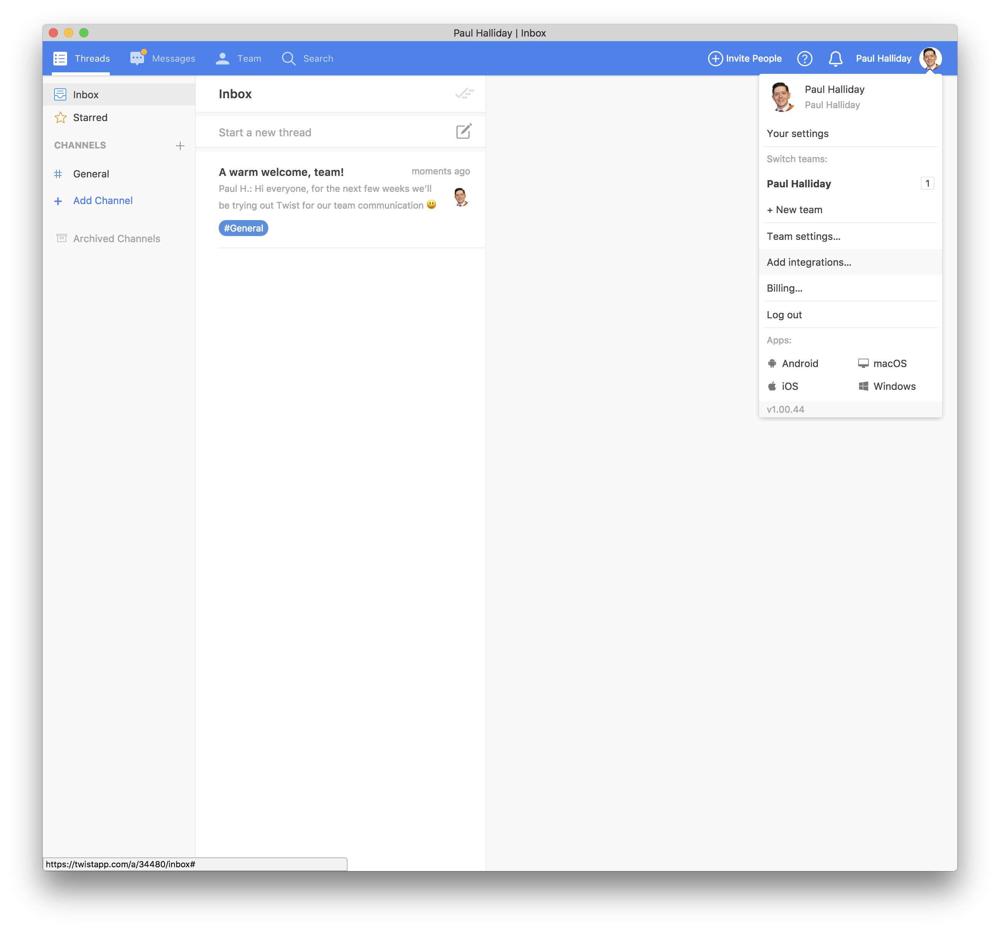

#### New Integration

Select 'Build' from the navigation menu and then 'Add new integration'. We can then select 'oAuth2 application' and fill out appropriate project information:

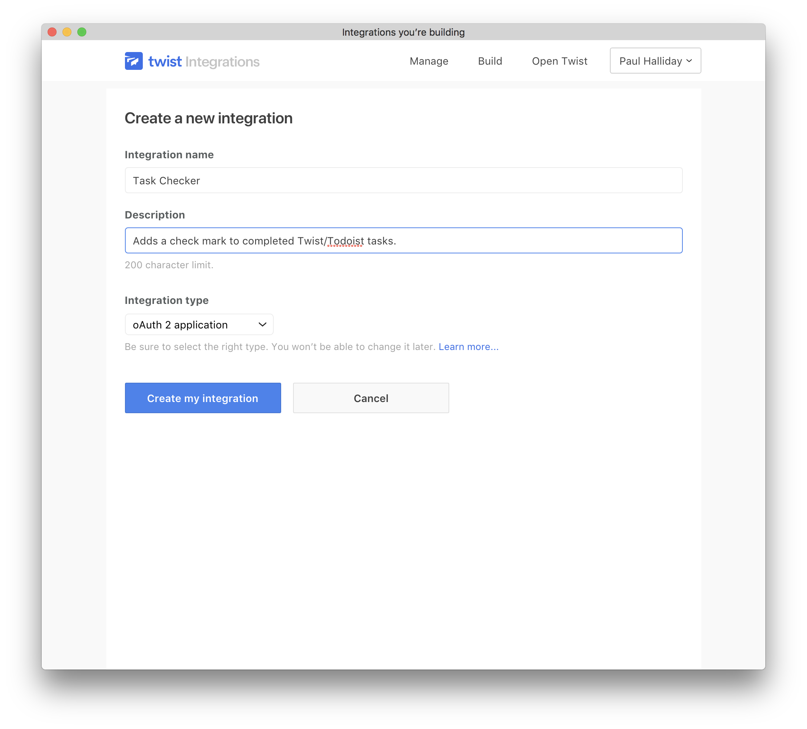

When finished, select 'Create my integration'.

### oAuth Test Token

In order to authenticate with our integration, we'll need to copy the oAuth Test Token from 'Basic Info' into our application. Let's add it here:

```javascript
// Omitted
const app = express();

const TWIST_TOKEN = `oauth2:0ae5517860755a0964b58c65bd821d322a98ba18`;
```

### Channel Integration

The next step is to create a channel integration that will allow us to perform the necessary updates whenever an item is completed.

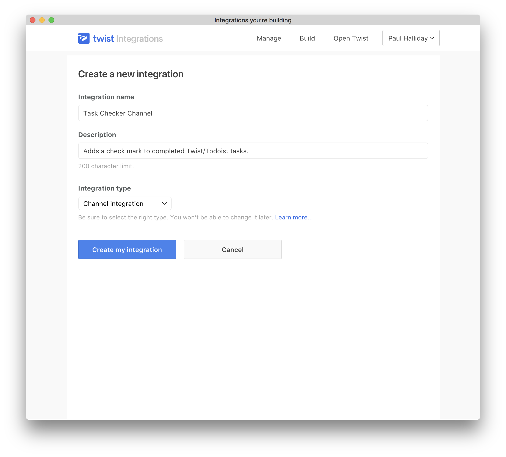

#### Exposing a URL

We now have an application on Twist but no exposed URL, for this we'll use ngrok. There are numerous ways to install `ngrok`, but perhaps the easiest for Node environments is via `npm`:

```bash
# Install ngrok globally
$ npm install ngrok -g
```

Using a new terminal window (with our server running) run the following command:

```bash
# Expose our project
$ ngrok http 3000
```

This starts a HTTP tunnel on based on our Node application that's running on port 3000.

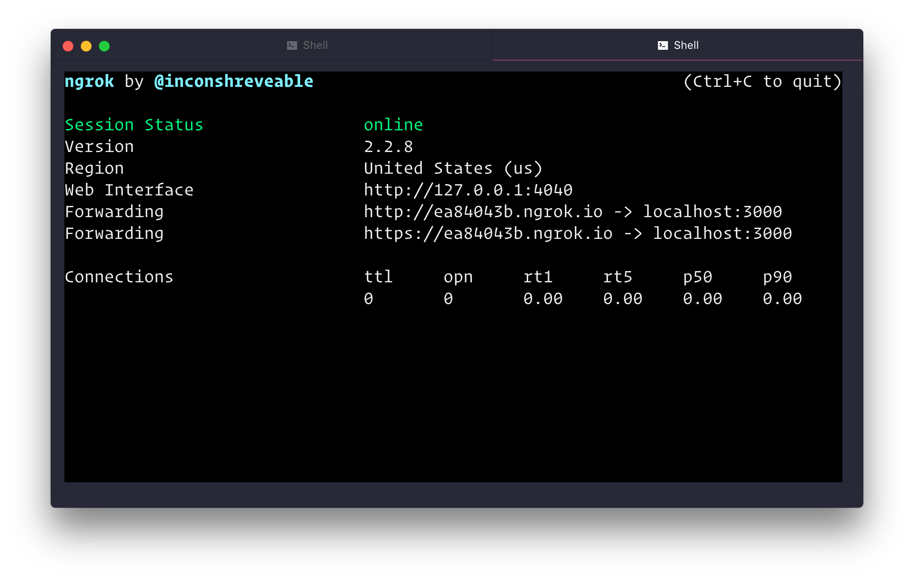

Copy the forwarding URL from your terminal, this will be different each time the `ngrok` command is ran. We can then place this inside of our Twist Integration Webhook:

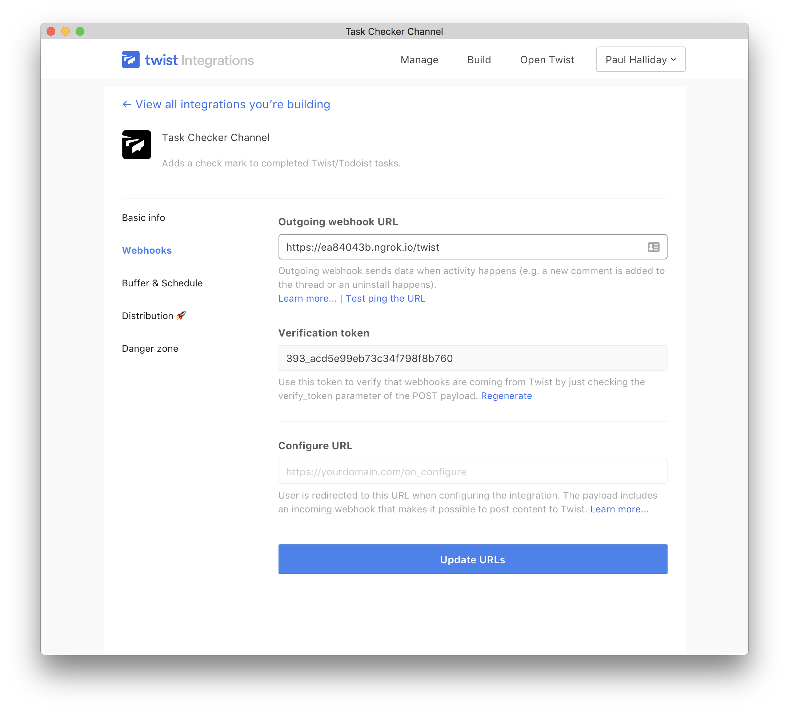

#### Adding to Team

In order to add this to our team, we need to follow the Distribution link and install it on our channel:

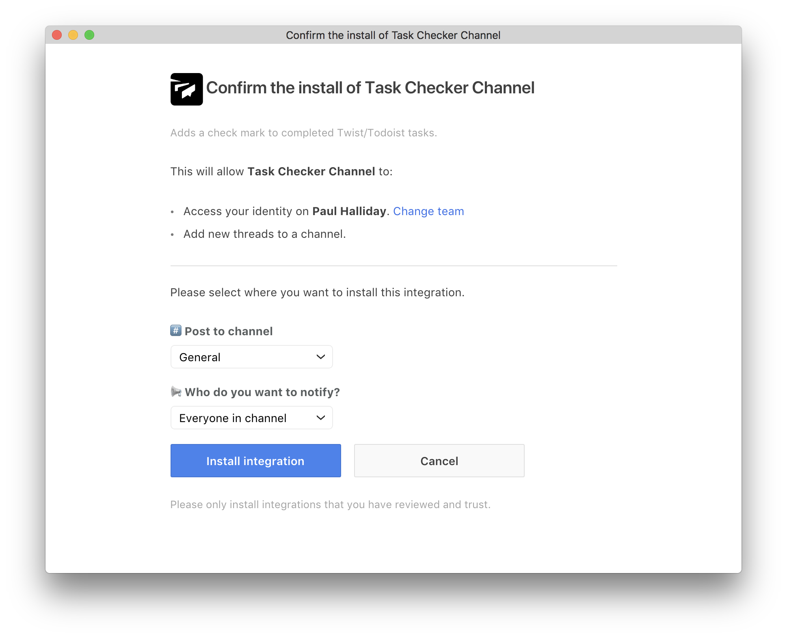

Now that we've set up our Twist integration, let's set up our Todoist Applet:

## Todoist Integration

### Create a New Application

Navigate to [https://developer.todoist.com](https://developer.todoist.com) and select 'Manage App' from the navigation bar. This allows us to create a new Application that can listen for Todoist user actions.

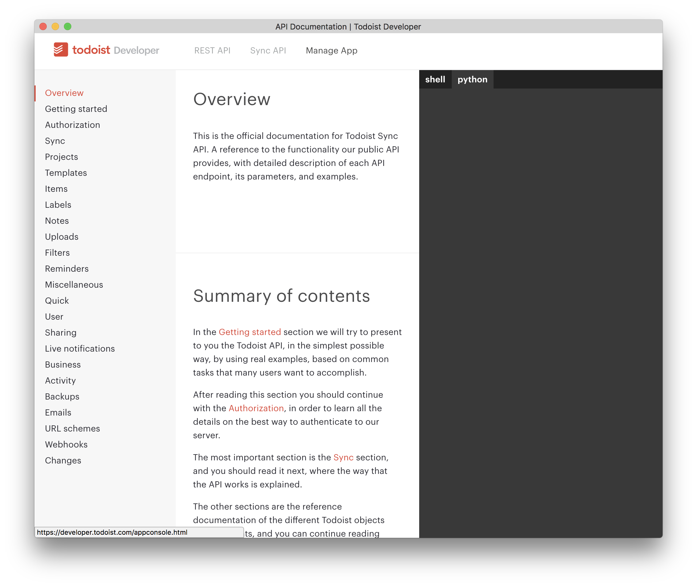

#### New Applet

We're then sent to the Todoist App Management dashboard, any existing applications will appear here. As it's our first application, select 'Create a new app'.

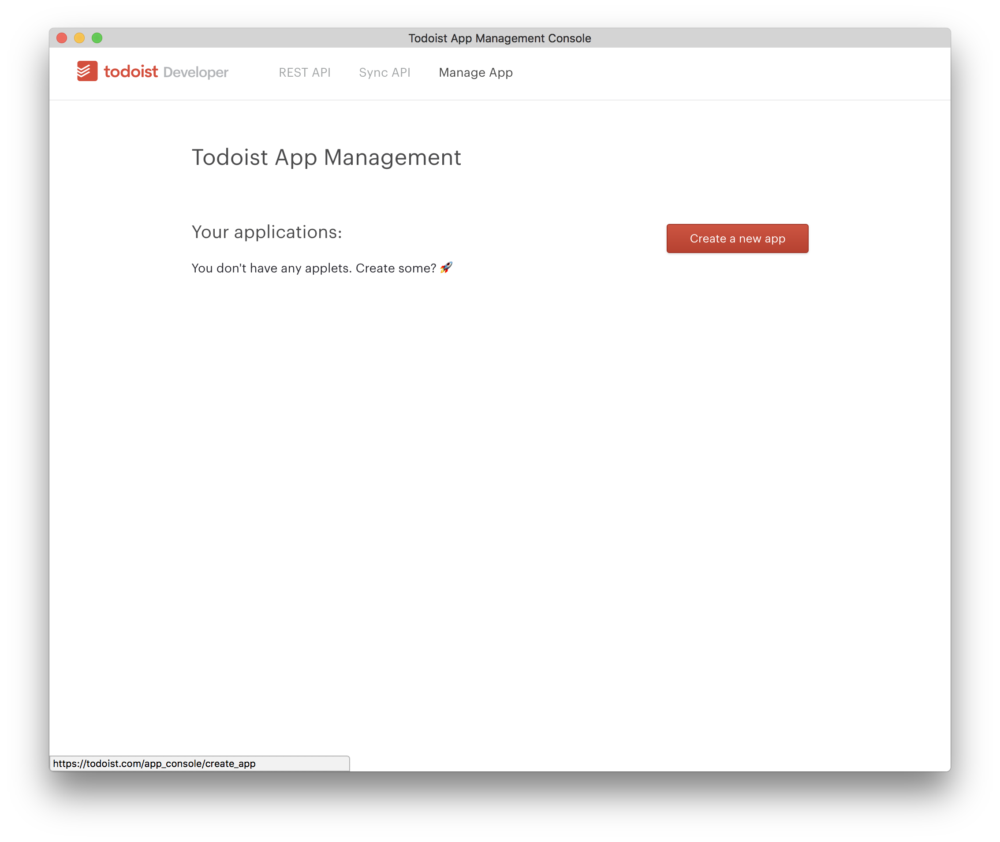

#### Application Name

Select an appropriate application name, such as 'TaskCheck'. If you have a service URL - add one here, if not, feel free to leave it blank and add it later.

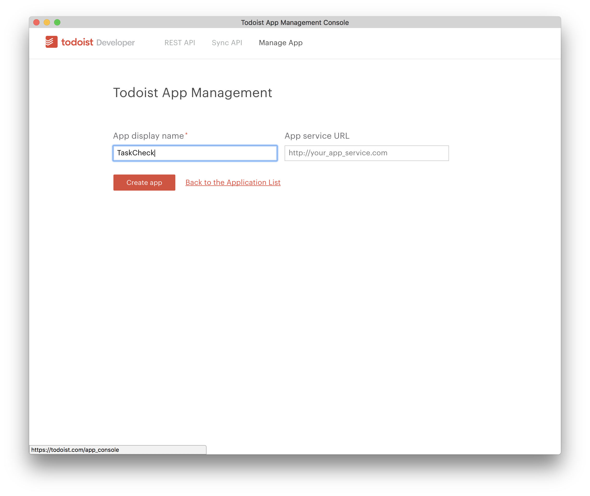

#### Webhook

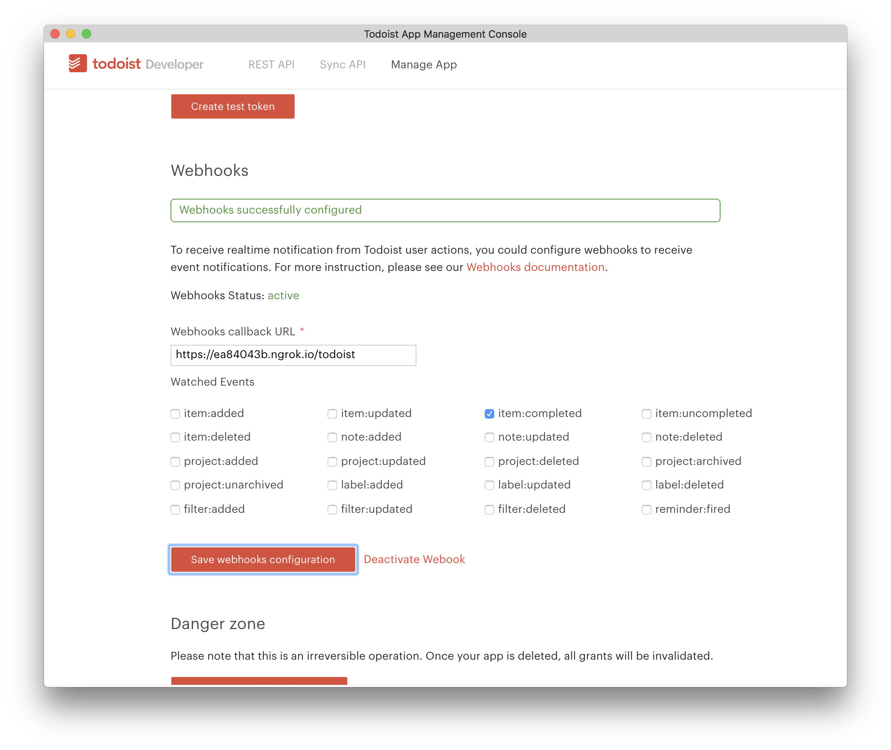

Ensure to tick the `item:completed` watched event, this means that any time a user completes a task a POST request is sent to: `https://{URL}/todoist`.

#### Test Token

The final piece to our Todoist Applet is to create a test token and add it to our application. Hit the 'Create test token' button and then add a new variable to our project:

```javascript
const TODOIST_TOKEN = 'df0cb339101534f3c212534a792b264d2cdce65f';
```

## Adding a new Todoist Task with Twist

Now that we have access to both Twist and Todoist webhooks, we're able to take action whenever a Twist thread is added or a Todoist task is completed.

### Twist Webhook

Start off by requiring Axios so that we can make HTTP requests and `uuid/v4` to generate random unique identifiers:

```javascript
const axios = require('axios');
const uuidv4 = require('uuid/v4');
```

We can then add a new task to Todoist whenever there is a new thread:

```javascript
const TODOIST_ROOT_URL = `https://todoist.com/api/v7/sync`;

app.post('/twist', async (req, res) => {
  const twistThread = req.body;
  console.log(`Incoming Twist: ${JSON.stringify(twistThread)}`);

  try {
    console.log(`Adding a new Todoist task.`);
    await addTodo(twistThread);
    res.sendStatus(200);
  } catch (error) {
    console.error(error);
    res.sendStatus(400);
  }
});

const addTodo = thread => {
  return axios.post(`${TODOIST_ROOT_URL}`, {
    token: TODOIST_TOKEN,
    commands: [
      {
        type: 'item_add',
        temp_id: uuidv4(),
        uuid: uuidv4(),
        args: {
          // 18273 Add check marks to tasks when completed
          content: `${thread.thread_id} ${thread.thread_title}`,
        },
      },
    ],
  });
};
```

When using `async` and `await`, it's important to add the appropriate keyword(s) to each function. If you haven't seen this before, this is a much cleaner way of dealing with promises and is supported in Node 7.6 and onward.

As expected, whenever we create a new thread on Twist we then get our task on Todoist:

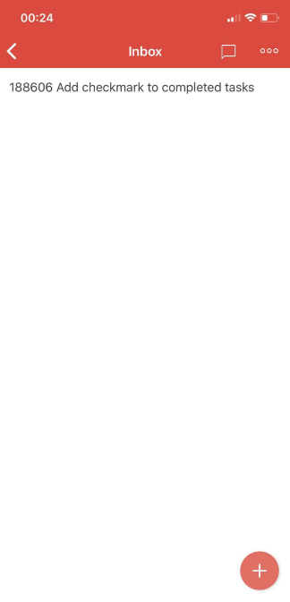

The next step is to add the ✅ icon to completed tasks. As our webhook is subscribing to `item:completed` events, we'll get a POST request whenever the user completes a task.

#### Capturing Task Data

Inside of our `/todoist` route, let's search for the `thread_id` from the request body. After that, we can get the thread data and perform an update with the new title:

```javascript
const TWIST_ROOT_URL = `https://api.twistapp.com/api/v2/threads`;

app.post('/todoist', async (req, res) => {
  const completedTask = req.body;
  console.log(`Incoming completed task: ${JSON.stringify(completedTask)}`);

  const content = completedTask.event_data.content;
  const thread_id = content.split(' ')[0];

  try {
    const result = await getOneThread(thread_id);
    const title = result.data.title;

    await updateThreadTitle(thread_id, title);
    res.sendStatus(200);
  } catch (error) {
    console.error(error);
    res.sendStatus(400);
  }
});

const updateThreadTitle = (thread_id, thread_title) => {
  const config = {
    headers: { Authorization: `Bearer ${TWIST_TOKEN}` },
  };

  const params = { title: `✅ ${thread_title}`, id: thread_id };

  return axios.post(`${TWIST_ROOT_URL}/update`, params, config);
};

const getOneThread = thread_id => {
  const config = {
    headers: { Authorization: `Bearer ${TWIST_TOKEN}` },
    params: { id: thread_id },
  };

  return axios.get(`${TWIST_ROOT_URL}/getone`, config);
};
```

Now whenever we add a task on Twist, the same task is added over on our Todoist application. When we complete the task, the title is updated with a ✅ on both platforms.

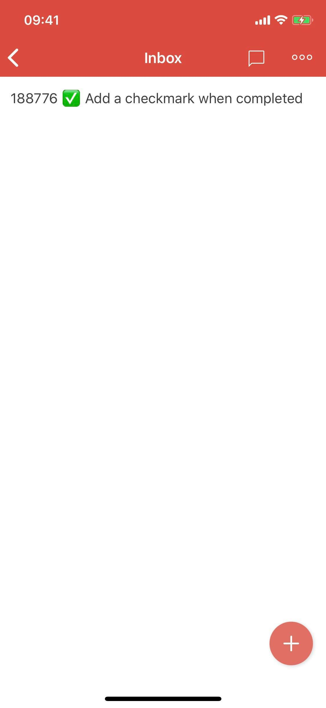
